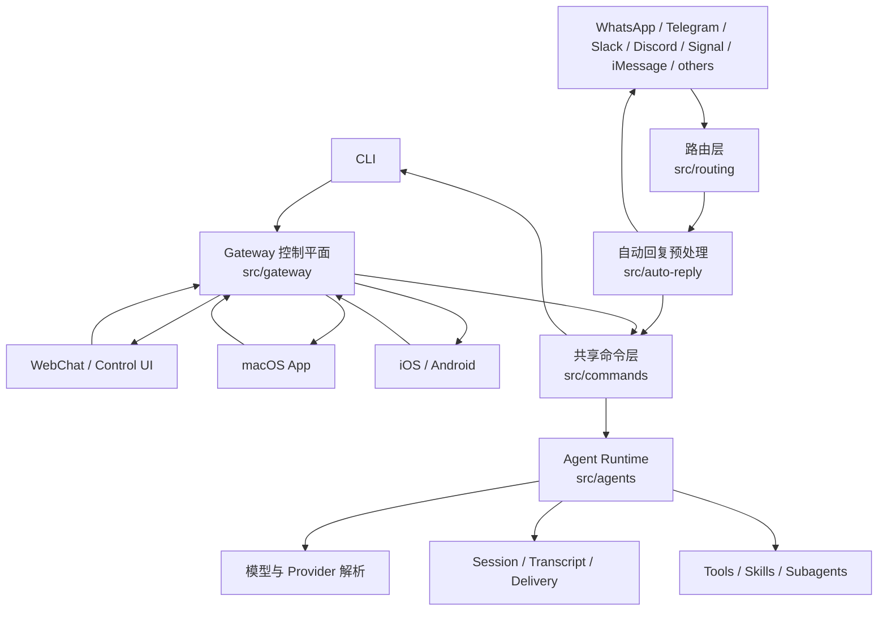
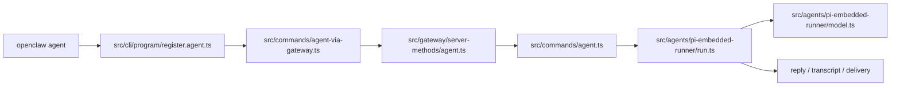
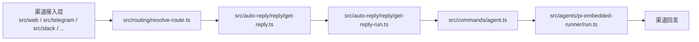
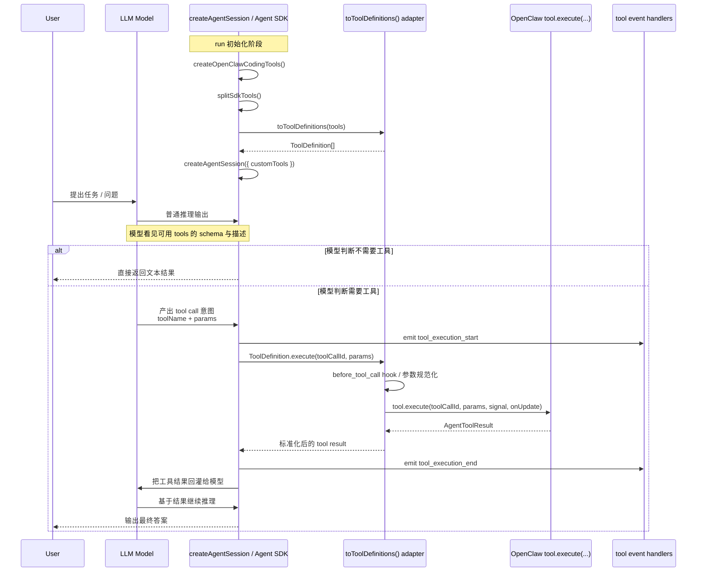

# OpenClaw 项目源码分析

本文是一份合并版源码导览，目标同时覆盖三类读者：

- 新手：想先快速知道“这个项目到底怎么跑起来”
- 进阶开发者：想找到核心目录、关键文件和调用链
- 架构视角读者：想理解它为什么会这样分层，以及这种分层解决了什么问题

如果只想先看一句话结论，可以直接记住下面这句：

> OpenClaw 的核心不是某个 UI，也不是某个聊天渠道，而是一套被 CLI、Gateway、App、消息渠道共同复用的 agent 执行内核。

### 文档更新说明（与当前源码对齐）

- **仓库结构**：补充 `src/acp`（ACP 运行时与 persistent bindings、control-plane、policy 等）。
- **执行入口**：明确 embedded 对外统一入口为 `src/agents/pi-embedded.ts`，再导出 `pi-embedded-runner`。
- **工具**：工具列表增加 `sessions_yield`；注明 `pi-tools.*` 已拆为多文件（policy、schema、read、before-tool-call 等），主入口仍为 `pi-tools.ts` 与 `openclaw-tools.ts`。
- **Subagent**：注明子 agent 注册/清理/完成回传已拆为多模块（subagent-registry-\*、subagent-announce、subagent-control 等）。

---

## 1. 新手先看：三分钟建立整体心智模型

### 1.1 这个项目到底是什么

从源码来看，OpenClaw 不是单一产品形态，而是一套“个人 AI 助手平台”的运行时系统。它有很多入口：

- CLI
- WebChat / Control UI
- macOS App
- iOS / Android 节点
- 多种消息渠道，例如 WhatsApp、Telegram、Slack、Discord、Signal、iMessage 等

这些入口最后不会各自调用一套独立模型逻辑，而是尽量汇聚到统一的 Gateway 和共享 agent 运行时。

### 1.2 用最朴素的话理解它

你可以把 OpenClaw 想成四层：

1. 最外层：用户从哪里发起请求
2. 中间层：系统如何把请求变成标准 agent 任务
3. 核心层：agent 如何选择模型、跑工具、维护会话
4. 出口层：结果如何被发回到 CLI、App 或聊天渠道

换成一句更工程化的话就是：

`入口层 -> Gateway / commands -> agent runtime -> model/tool/session -> 结果投递`

### 1.2.1 “标准 agent 任务”长什么样

中间层产出的**标准 agent 任务**在代码里就是一次 `agentCommandFromIngress(opts, runtime, deps)` 的入参 `opts`，类型是 `AgentCommandIngressOpts`（定义在 `src/commands/agent/types.ts`）。  
无论请求来自 CLI、WebChat、macOS App 还是某条聊天渠道，最终都会收敛成同一形状，再交给 `src/commands/agent.ts` 和 embedded runner 执行。

**必填与常用字段示例：**

```ts
// 最简形态：只带消息和会话归属
{
  message: "今天有什么待办？",
  sessionKey: "agent:main:main",   // 或 agent:main:subagent:<uuid> 等
  senderIsOwner: true,             // ingress 必须显式传
}

// 从 Gateway/渠道 整理后的典型形态（会话已解析、投递目标已算好）
{
  message: "帮我总结一下上周的会议纪要",
  sessionKey: "agent:main:main",
  sessionId: "550e8400-e29b-41d4-a716-446655440000",
  channel: "telegram",
  accountId: "default",
  to: "telegram:group:-1001234567890:topic:42",
  threadId: "42",
  deliver: true,
  messageChannel: "telegram",
  runContext: {
    messageChannel: "telegram",
    accountId: "default",
    currentThreadTs: "42",
  },
  senderIsOwner: false,
}
```

**字段含义速览：**

| 字段                                     | 含义                                                          |
| ---------------------------------------- | ------------------------------------------------------------- |
| `message`                                | 用户输入正文（可能已带时间戳、媒体说明、thread 上下文等前缀） |
| `sessionKey`                             | 会话唯一键，决定用哪个 agent、进哪个 session                  |
| `sessionId`                              | 当前会话的 ephemeral id（如 /new、/reset 会变）               |
| `channel` / `accountId`                  | 投递目标渠道与账号                                            |
| `to`                                     | 具体投递目标（如 telegram:group:xxx:topic:yy）                |
| `threadId`                               | 线程/话题 id，回信时贴回同 thread                             |
| `deliver`                                | 是否把回复发到外部渠道                                        |
| `messageChannel`                         | 来源渠道（用于工具、权限等上下文）                            |
| `runContext`                             | 嵌入式运行时的渠道/账号/thread 等上下文                       |
| `senderIsOwner`                          | 是否视为 owner（影响 owner-only 工具）                        |
| `thinking` / `verbose` / `timeout`       | 可选行为与限制                                                |
| `images`                                 | 可选多模态图片                                                |
| `spawnedBy` / `groupId` / `workspaceDir` | 子任务/群组/工作区继承用                                      |

CLI 调用时由 `agent-via-gateway` 或本地 fallback 拼出类似的 `opts`；聊天渠道则由 `resolve-route` 得到 `agentId`/`sessionKey`，再由 `auto-reply` 的 `getReplyFromConfig` → `runPreparedReply` 拼出 `message`、`sessionKey`、`deliver`、`runContext` 等，最终调用的仍是同一个 `agentCommandFromIngress(opts, ...)`。  
因此**“标准 agent 任务”就是这份统一的 `AgentCommandIngressOpts` 对象**。

### 1.2.2 最终发给大模型的请求结构（含工具时）

在 embedded runner 里，标准 agent 任务会再被转成**一次发给大模型 API 的“上下文”**。  
这个上下文的类型在底层由 `@mariozechner/pi-ai` 的 `Context` 约定，`streamFn(model, context, options)` 用的就是它。  
在 OpenClaw 里，**发给大模型的一轮请求**可以概括成下面三部分。

**1. 系统提示（systemPrompt）**

- 一段长文本，由 `buildEmbeddedSystemPrompt` / `buildAgentSystemPrompt` 拼出来。
- 里面包含：身份与规则、workspace 说明、当前可用工具名列表 + 简短摘要、skills 说明、渠道/权限/沙箱等运行时信息。
- 会先通过 `applySystemPromptOverrideToSession` 写入 session，再在每次请求里随 context 一起发给模型。

**2. 消息列表（messages）**

- 即“对话历史 + 本轮的当前用户输入”。
- 每条消息是**多轮对话里的一个 turn**，用 `role` 区分是谁在说话、以及是否是工具结果。

**典型消息形状（发给模型时）：**

```ts
// 用户轮
{ role: "user", content: "帮我查一下北京明天天气" }
// 或多模态：content 为数组，如 [{ type: "text", text: "..." }, { type: "image", ... }]

// 助手轮（纯文本）
{
  role: "assistant",
  content: [{ type: "text", text: "正在查天气…" }],
  stopReason: "tool_calls",
  usage: { ... },
  timestamp: 1234567890,
}

// 助手轮（含工具调用）
{
  role: "assistant",
  content: [
    { type: "text", text: "正在查天气…" },
    { type: "toolCall", id: "call_abc", name: "web_search", arguments: { query: "北京 明天 天气" } },
  ],
  stopReason: "tool_calls",
  ...
}

// 工具结果轮（执行完工具后塞回对话，让模型继续）
{
  role: "toolResult",
  toolCallId: "call_abc",
  toolName: "web_search",
  content: [{ type: "text", text: "北京明天晴，15-25°C…" }],
  isError: false,
  timestamp: 1234567891,
}
```

也就是说：**发给大模型的问题结构 = `systemPrompt` + `messages`（含 user / assistant / toolResult）**。  
带工具时，`messages` 里会交替出现 `assistant`（可能带 `content` 里的 `type: "toolCall"`）和 `toolResult`。

**3. 工具定义（tools）**

- 当次 run 允许调用的工具列表，对应 `createAgentSession` 的 `customTools`（经 `toToolDefinitions` 转成底层 `ToolDefinition`）。
- 每个工具发给模型的是**声明层**，即 name、description、parameters（JSON Schema），**不包含 execute**。  
  执行在 OpenClaw 运行时里做：模型产出 `toolCall`，adapter 调 `tool.execute(...)`，再把结果写成一条 `toolResult` 消息塞回 `messages`，继续下一轮。

**带工具时的一次请求可以理解为：**

```ts
{
  systemPrompt: "...(身份、workspace、工具摘要、skills 等)...",
  messages: [
    { role: "user", content: "北京明天天气怎么样？" },
    {
      role: "assistant",
      content: [
        { type: "text", text: "正在查。" },
        { type: "toolCall", id: "call_1", name: "web_search", arguments: { query: "北京 明天 天气" } },
      ],
      stopReason: "tool_calls",
      ...
    },
    {
      role: "toolResult",
      toolCallId: "call_1",
      toolName: "web_search",
      content: [{ type: "text", text: "北京明天晴，15-25°C。" }],
      isError: false,
    },
  ],
  tools: [
    { name: "web_search", description: "...", parameters: { type: "object", properties: { query: {} }, ... } },
    { name: "read", description: "...", parameters: { ... } },
    // ...
  ],
}
```

**大模型回复的是什么**

- 大模型每次“回复”在类型上对应底层 SDK 的 **`AssistantMessage`**（如 `@mariozechner/pi-ai` 的 `AssistantMessage`）。
- 流式时，会先收到 `message_start`、中间 content 块、最后 `message_end`；**聚合后的完整回复**就是一条 `AssistantMessage`，例如：

```ts
{
  role: "assistant",
  content: [
    { type: "text", text: "北京明天晴，15-25°C，适合出门。" },
    // 若本轮还调了工具，会有：
    // { type: "toolCall", id: "call_2", name: "message", arguments: { ... } },
  ],
  stopReason: "end_turn",   // 或 "tool_calls" | "max_tokens" | "error" 等
  usage: { input: 1200, output: 50, ... },
  api: "openai-responses",
  provider: "openai",
  model: "gpt-5.2",
  timestamp: 1234567892,
}
```

- **content**：数组，每个元素要么是 `{ type: "text", text: string }`，要么是 `{ type: "toolCall", id, name, arguments }`。  
  没有工具时通常只有 text；有工具时可能先 text 再 toolCall，或只有 toolCall。
- **stopReason**：表示本轮为何结束（正常结束、要调工具、超长、错误等）。
- 运行时根据 `content` 里的 `toolCall` 执行工具，把结果写成 `toolResult` 消息追加到 `messages`，再发起下一轮请求；若 `stopReason === "end_turn"` 且没有待执行的 toolCall，则把 text 作为最终回复交给投递/CLI。

**小结**

| 阶段       | 结构概要                                                                                                                        |
| ---------- | ------------------------------------------------------------------------------------------------------------------------------- |
| 发给大模型 | `systemPrompt`（ string ）+ `messages`（ user / assistant / toolResult 数组）+ `tools`（ name / description / parameters 数组） |
| 带工具时   | `messages` 中交替出现含 `type: "toolCall"` 的 assistant 与 `role: "toolResult"` 的消息；`tools` 非空。                          |
| 大模型回复 | 一条 `AssistantMessage`：`role: "assistant"`，`content` 为 text 或 toolCall 块数组，`stopReason`，`usage` 等。                  |

### 1.3 为什么这个视角重要

很多人第一次读这类仓库时，会先盯着某个界面或者某个渠道模块看，结果越看越散。  
这个项目更好的阅读方式不是“从前端往下看”，而是先抓住共享执行内核，再回头看不同入口如何接入它。

---

## 2. Mermaid 架构图

### 2.1 整体架构图



### 2.2 核心 agent 执行链图



### 2.3 消息渠道自动回复链图



---

## 3. 仓库结构总览

如果按职责划分，这个仓库可以理解为几块核心区域。

### 3.1 `src/`：最重要的主仓

`src/` 是 OpenClaw 的核心实现区，里面最值得优先建立认知的是下面这些目录。

#### `src/cli`

负责 CLI 启动、命令注册、参数解析。  
它主要解决“用户如何调用系统”，不负责复杂业务本身。

#### `src/commands`

这是共享业务层。  
CLI、Gateway，以及其他内部入口，最终都会尽量落到这里。  
其中 `src/commands/agent.ts` 是整个单次 agent 执行最关键的总调度器之一。

#### `src/gateway`

这是统一控制平面。  
它通过 WebSocket / RPC 对外暴露能力，供 CLI、WebChat、macOS、iOS、Android 和其他客户端使用。

你可以把它理解为：

- 系统总线
- 统一入口
- 状态事件分发中心

#### `src/agents`

这里是核心 agent 运行时。  
包括但不限于：

- 模型选择
- provider 解析
- auth profile
- skills
- workspace
- subagents
- embedded Pi runner
- tool 调用
- fallback 与重试

#### `src/auto-reply`

这是“外部消息转 agent 任务”的关键层。  
它不直接等于模型调用，而是负责在模型执行之前把上下文装好。

它处理的内容包括：

- 消息理解
- directives
- media understanding
- link understanding
- typing
- session 初始化与恢复
- 回复包装

#### `src/routing`

负责把消息来源映射成内部 `agentId` 和 `sessionKey`。  
这是多渠道系统能共享同一套 agent 内核的基础层。

#### `src/web`、`src/discord`、`src/slack`、`src/telegram`、`src/signal`、`src/imessage`

这些目录主要是渠道接入层。  
它们负责：

- 收消息
- 识别上下文
- 发回复

但不应该被理解为“各自有一套完整 agent 实现”。

#### `src/channels`

渠道抽象与渠道共享逻辑。

#### `src/providers`

provider 相关能力所在目录。  
不过真正和模型落地执行最强关联的逻辑，仍然主要集中在：

- `src/agents/model-selection.ts`
- `src/agents/pi-embedded-runner/model.ts`

#### `src/acp`

ACP（Agent Client Protocol）运行时与调度层。  
用于接入外部 coding harness（如 Codex、Claude Code、Gemini CLI 等），与原生 subagent 并列：

- `src/acp/control-plane/`：ACP session 管理、spawn、runtime 选项
- `src/acp/runtime/`：session 身份、错误、registry
- `src/acp/persistent-bindings*.ts`：渠道与 ACP session 的持久绑定与路由
- `src/acp/policy.ts`、`src/acp/translator.ts`：策略与协议转换

详见 `docs/tools/acp-agents.md`。

### 3.2 `apps/`：客户端与节点

- `apps/macos`
- `apps/ios`
- `apps/android`

这些目录代表的是不同终端形态，但它们并不是“分别实现各自的 agent”，而是通过 Gateway 协议接入同一套核心后端。

### 3.3 `extensions/`：扩展生态

`extensions/*` 表明 OpenClaw 有明确的插件化设计，不是完全封闭的单体系统。  
很多扩展渠道、工具和附加能力都可以在这个层面演进。

### 3.4 其他辅助目录

- `docs/`：文档
- `scripts/`：构建、开发、发布脚本
- `skills/`：技能相关资源
- `test/` 与 `*.test.ts`：测试
- `dist/`：构建产物

---

## 4. 先从哪读最不容易迷路

如果你是第一次看这套源码，建议不要随机点文件，而是按下面顺序建立主链路。

1. `src/cli/program/register.agent.ts`
2. `src/commands/agent-via-gateway.ts`
3. `src/gateway/server-methods/agent.ts`
4. `src/commands/agent.ts`
5. `src/agents/pi-embedded-runner/run.ts`
6. `src/agents/pi-embedded-runner/model.ts`
7. `src/routing/resolve-route.ts`
8. `src/auto-reply/reply/get-reply.ts`

这个顺序的好处是：

- 先抓住入口
- 再看共享调度
- 最后看路由和自动回复补充层

---

## 5. 入口层是怎么接到 agent 的

### 5.1 CLI 入口

CLI 相关入口的关键文件是：

- `src/cli/program/command-registry.ts`
- `src/cli/program/register.agent.ts`

`register.agent.ts` 会注册 `openclaw agent` 命令，但它本身只是一个“薄入口”。  
它真正的价值在于把命令行参数接到共享业务层，而不是自己承担复杂执行逻辑。

接下来 CLI 会进入：

- `src/commands/agent-via-gateway.ts`

这个文件体现了一个非常重要的架构原则：

- 优先通过 Gateway 跑 agent
- 当 Gateway 不可用，或显式指定 `--local` 时，再回退到 embedded 本地执行

这意味着 CLI 在架构上更像是“统一控制面客户端”，而不是一个直接耦合模型 API 的命令工具。

### 5.2 Gateway 入口

Gateway 端处理 agent 请求的关键文件是：

- `src/gateway/server-methods/agent.ts`

这个模块负责：

- 校验 agent 请求参数
- 规范化 session、channel、delivery、附件等字段
- 处理 `/new`、`/reset` 之类的会话控制指令
- 根据上下文准备 ingress 参数
- 最终调用共享业务层 `agentCommandFromIngress()`

所以 Gateway 并不是另写了一套 agent 系统，而是在充当统一 RPC 入口和控制平面。

---

## 6. 核心 agent 功能是怎么实现的

### 6.1 真正的总调度器：`src/commands/agent.ts`

如果要选一个最应该读的核心文件，`src/commands/agent.ts` 一定在前列。

它的角色不是“完成一个小步骤”，而是对一次 agent turn 做全流程编排。它会负责：

- 解析或创建 session
- 根据 `sessionKey` 推断 `agentId`
- 解析 workspace 和 agentDir
- 构建 skills 快照
- 处理 thinking、verbose、timeout
- 决定 provider / model / fallback
- 处理 auth profile
- 选择走 ACP 还是 embedded Pi runtime
- 写 transcript 与 session store
- 在需要时把结果投递回外部渠道

因此这个文件更像一个 orchestration 层，而不是一个“模型调用函数”。

### 6.2 真正跑起来的执行引擎：`src/agents/pi-embedded-runner/run.ts`

`src/commands/agent.ts` 决定“怎么编排”，  
`src/agents/pi-embedded-runner/run.ts` 决定“怎么执行”。

对外统一入口是 `src/agents/pi-embedded.ts`：它从 `pi-embedded-runner` 再导出 `runEmbeddedPiAgent`、`compactEmbeddedPiSession`、`abortEmbeddedPiRun` 等，CLI 与 Gateway 侧通过 `pi-embedded.js` 引用，便于单一切口与测试替换。

`runEmbeddedPiAgent()` 里包含很多工程化运行逻辑，主要包括：

- lane / queue 调度
- plugin hooks
- 上下文窗口保护
- auth profile 的选择、打标、冷却和恢复
- 重试与 failover
- 工具结果上下文管理
- usage / token / cost 统计

也就是说，这个函数不是“调一次模型 API”那么简单，而是一个已经具备生产运行防护能力的 agent runtime。

### 6.3 模型与 provider 统一解析：`src/agents/pi-embedded-runner/model.ts`

这个文件解决的是“配置里写的 provider/model，最终如何变成可运行对象”。

它主要负责：

- provider 名称标准化
- 从模型注册表解析模型
- 应用 provider 级别覆盖项
- 处理 forward-compat 模型
- 处理像 OpenRouter 这类透传 provider
- 生成统一的 model 定义对象

这意味着 OpenClaw 对多 provider 的兼容，不是散落在业务代码里的大量分支，而是被尽量收敛到统一模型解析层。

### 6.4 routing 不是附属功能，而是主干：`src/routing/resolve-route.ts`

很多系统里“路由”只是边角逻辑，但在 OpenClaw 里不是。

它需要解决的是：

- 这条消息属于哪个 agent
- 这条消息应该进入哪个 sessionKey
- 多个渠道、多个账号、私聊、群聊、团队场景，如何稳定地落到一致的内部会话语义

它会综合考虑：

- `channel`
- `accountId`
- `peer`
- `parentPeer`
- `guildId`
- `teamId`
- `memberRoleIds`

从架构意义上说，`resolve-route.ts` 是“多入口系统仍然能共享单内核”的关键支点之一。

### 6.5 聊天消息并不是直接送进模型：`src/auto-reply/reply/get-reply.ts`

这个模块的价值在于，它把“真实世界里的消息”预处理成“标准 agent run 请求”。

它会做的事情包括：

- 解析目标 agent 和 session
- 合并 skill filter
- 决定默认 provider / model
- 初始化或恢复 session 状态
- media understanding
- link understanding
- reset 流程处理
- directive 处理
- typing 控制
- 最终把标准化后的请求交给后续 runner

这层的存在说明 OpenClaw 很强调“消息上下文装配”，而不是把所有问题粗暴地下沉给模型。

---

## 7. 两条最重要的调用链

### 7.1 从 CLI 发起一次 agent 运行

1. `src/cli/program/command-registry.ts`
2. `src/cli/program/register.agent.ts`
3. `src/commands/agent-via-gateway.ts`
4. `src/gateway/server-methods/agent.ts`
5. `src/commands/agent.ts`
6. `src/agents/pi-embedded-runner/run.ts`
7. `src/agents/pi-embedded-runner/model.ts`
8. transcript / delivery / reply output

### 7.2 从消息渠道触发一次自动回复

1. 渠道接入层收到消息，例如 `src/web/*` 或其他 channel 模块
2. `src/routing/resolve-route.ts` 决定目标 `agentId` 与 `sessionKey`
3. `src/auto-reply/reply/get-reply.ts` 整理上下文
4. `src/auto-reply/reply/get-reply-run.ts`
5. 共享调度层 `src/commands/agent.ts`
6. `src/agents/pi-embedded-runner/run.ts`
7. 最终由渠道层把结果回发

### 7.3 类 Unix 风格时序图

如果你更习惯从“一个请求在系统里如何流动”来理解代码，可以把一次 CLI 调用近似看成下面这样：

```text
$ openclaw agent --agent ops --message "summarize logs"
        |
        v
[src/cli/program/register.agent.ts]
  registerAgentCommands()
        |
        v
[src/commands/agent-via-gateway.ts]
  agentCliCommand()
    -> 默认走 agentViaGatewayCommand()
    -> Gateway 失败时回退 agentCommand()
        |
        v
[src/gateway/server-methods/agent.ts]
  agentHandlers.agent()
    -> 校验参数
    -> 规范化 session / delivery / idempotency
    -> dispatchAgentRunFromGateway()
        |
        v
[src/commands/agent.ts]
  agentCommandFromIngress()
    -> agentCommand()
    -> 解析 session / agentId / workspace / skills / timeout
    -> 决定 ACP 还是 embedded runner
        |
        v
[src/agents/pi-embedded-runner/run.ts]
  runEmbeddedPiAgent()
    -> lane / queue
    -> hooks
    -> resolveModel()
    -> auth profile / retry / failover
    -> tool execution / usage stats
        |
        v
[src/agents/pi-embedded-runner/model.ts]
  resolveModel()
    -> resolveModelWithRegistry()
    -> 产出统一 provider/model 定义
        |
        v
[session / transcript / delivery]
  写入会话状态
  生成回复 payload
  必要时投递回渠道
        |
        v
CLI / WebChat / App / 消息渠道收到最终结果
```

如果换成聊天渠道入口，前半段会变成这样：

```text
外部消息进入渠道适配层
        |
        v
[src/routing/resolve-route.ts]
  resolveAgentRoute()
    -> 算出 agentId + sessionKey
        |
        v
[src/auto-reply/reply/get-reply.ts]
  预处理消息上下文
    -> media / link understanding
    -> directive / typing / session state
        |
        v
[src/auto-reply/reply/get-reply-run.ts]
  runPreparedReply()
        |
        v
[src/commands/agent.ts]
  agentCommand() / embedded runtime
```

---

## 8. 多 agent 与通信模型

这部分回答一个很关键的问题：OpenClaw 到底是不是多 agent 系统，如果是，多 agent 之间怎么协作、怎么通信、怎么回传结果。

### 8.1 是否支持多 agent

支持，而且是明确的一等能力。

从配置和运行时实现来看，OpenClaw 不只是“一个主助手 + 很多工具”，而是支持多个独立 agent 并存的系统。不同 agent 可以有各自的：

- `agentId`
- workspace
- agentDir
- model 配置
- skills
- session store
- routing 绑定

这些 agent 可以被 CLI、Gateway、聊天渠道或内部工具分别调起。

### 8.2 一个 agent 下能否有多个子 agent

可以，但更准确地说，限制单位是“一个 requester session 可以派生多个 subagent session”。

代码里和这件事直接相关的配置有：

- `agents.defaults.subagents.maxConcurrent`
  - 控制 subagent 全局 lane 的并发上限
- `agents.defaults.subagents.maxChildrenPerAgent`
  - 控制单个 requester session 最多能挂多少个活跃子 agent
- `agents.defaults.subagents.maxSpawnDepth`
  - 控制子 agent 是否还能继续生成下一级子 agent

从当前实现看：

- 一个主 agent session 可以同时拥有多个子 agent
- 默认 `maxChildrenPerAgent` 是 **5**
- 默认 `maxSpawnDepth` 是 **1**

这意味着默认情况下：

- 主 agent 可以生成第一层 subagent
- 第一层 subagent 默认是叶子节点，不能继续生成下一层

如果把 `maxSpawnDepth` 调大，例如调成 `2` 或 `3`，那么就能形成真正的多层 agent 树。

### 8.3 多 agent 是并行还是串行

不是简单的“全并行”或“全串行”，而是分层并发模型：

- 同一个 session 内部是串行的
- 不同 session 之间可以并行
- 普通 agent 和 subagent 还会分别走不同的全局 lane

实现上主要体现在：

- `src/process/command-queue.ts`
  - 每个 lane 都有自己的队列和 `maxConcurrent`
- `src/agents/pi-embedded-runner/lanes.ts`
  - 会把 session 映射成 `session:<key>` 这种 lane
- `src/gateway/server-lanes.ts`
  - 启动时给 `main`、`subagent`、`cron` 等 lane 设置并发上限

所以更准确地说：

> OpenClaw 的多 agent 运行模型是“同 session 串行、跨 session 并行、并且受 lane 并发上限控制”。

### 8.4 普通 agent 和普通 agent 之间怎么通信

普通 agent 之间的通信核心不是共享内存，也不是直接函数调用，而是**通过 session 工具向另一个 session 发消息**。

关键工具是：

- `sessions_send`
- `sessions_list`
- `sessions_history`

其中最关键的是：

- `src/agents/tools/sessions-send-tool.ts`

这个工具的核心逻辑是：

1. 解析目标 session
   - 既可以直接传 `sessionKey`
   - 也可以通过 `label` + 可选 `agentId` 解析目标
2. 做可见性与权限检查
   - 同 agent、跨 agent、sandbox 场景都有限制
   - 跨 agent 通信还要通过 `tools.agentToAgent` 策略
3. 构造一次内部 agent 请求
   - 调 Gateway 的 `agent` 方法
   - `deliver: false`
   - `channel: INTERNAL_MESSAGE_CHANNEL`
   - `lane: AGENT_LANE_NESTED`
4. 给目标 session 发送一条“内部消息”
   - 这条消息不是外部聊天渠道消息
   - 而是系统内部 session-to-session 消息

也就是说，OpenClaw 的 agent-to-agent 通信，本质上是：

> 把一个 agent 的请求包装成内部 session 消息，再投递到另一个 agent session 里运行。

这套机制的好处是，agent 间通信仍然沿用统一的 session、transcript、tool、timeout 和 reply 体系，而不是另建一套 IPC 机制。

### 8.5 普通 agent 和子 agent 怎么通信

父 agent 和子 agent 的关系，本质上是“请求者 session”和“派生 session”的关系。

创建子 agent 时，核心路径是：

- `sessions_spawn`
- `src/agents/subagent-spawn.ts`

子 agent 的注册、清理、完成回传等已拆成多模块：`subagent-registry.ts`、`subagent-registry-store.ts`、`subagent-registry-queries.ts`、`subagent-registry-cleanup.ts`、`subagent-registry-completion.ts`、`subagent-registry-runtime.ts`、`subagent-registry-state.ts`、`subagent-announce.ts`、`subagent-control.ts` 等，便于扩展与测试。

spawn 时会记录一组很关键的关系信息：

- `requesterSessionKey`
- `childSessionKey`
- `runId`
- child depth
- spawn metadata

也就是说，子 agent 不是匿名启动的，它从创建开始就和父 session 建立了明确关联。

### 8.6 子 agent 的结果怎么回给父 agent

这部分是 OpenClaw 很重要的一点：**子 agent 默认不是自己去“主动找父 agent 汇报”，而是走自动 announce 回传链路。**

核心实现是：

- `src/agents/subagent-registry.ts`
- `src/agents/subagent-announce.ts`

里面的关键机制包括：

- subagent registry 维护 `requesterSessionKey -> childSessionKey -> runId` 的运行关系
- 子 agent 完成后，会触发 `runSubagentAnnounceFlow()`
- 完成结果会自动整理成一条内部编排消息回到请求者 session

而且这里还有一个很重要的行为：

- 如果父级本身也是 subagent，那么子 agent 的结果会**先回到直接父级 subagent**
- 不会越级直接回到最顶层主 agent

也就是说，它是树状回传，不是广播式回传。

这点在 `src/agents/subagent-announce.ts` 的系统提示里写得非常明确：

- 你的 subagents 会自动把结果回传给你
- 不是回给 main agent
- 让你先做编排、汇总、再向上报告

所以父子 agent 通信的主通道不是 `sessions_send`，而是：

> `sessions_spawn` 创建子 agent，子 agent 完成后通过 announce 流自动把结果推回父 agent。

### 8.7 子 agent 是否能主动联系父 agent

可以，但默认设计鼓励“自动回传”，不鼓励忙轮询。

从 `subagent` 的 system prompt 和工具策略可以看出，推荐模式是：

- 父 agent 生成子 agent
- 子 agent 专注完成任务
- 完成后自动回传
- 父 agent 负责汇总多个子 agent 的结果

而不是：

- 子 agent 不断用轮询方式问父 agent 要不要继续
- 父 agent 不断去 `sessions_list` / `sessions_history` 忙查询

这也是它能够支撑多 subagent 并发编排的重要原因。

### 8.8 父 agent 如何管理子 agent

除了自动回传，OpenClaw 还提供了对子 agent 的显式管理工具。

关键文件是：

- `src/agents/tools/subagents-tool.ts`

它支持的能力包括：

- 查看子 agent 状态
- 对子 agent 做 steer
- 中断或重启子 agent
- 等待或读取特定运行状态

例如在 `subagents-tool.ts` 里，steer 会：

- 先中断当前子 agent 运行
- 清理对应 queue / lane
- 再向对应 `childSessionKey` 发起新的内部 agent 请求

这说明父 agent 和子 agent 的关系并不是“一次 spawn 之后就再也不能干预”，而是存在一个完整的 orchestration / supervision 模型。

### 8.9 一句话总结多 agent 通信模型

可以把 OpenClaw 的多 agent 通信理解成两类：

- 普通 agent <-> 普通 agent
  - 主要通过 `sessions_send`
  - 本质是 session-to-session 的内部消息投递

- 父 agent <-> 子 agent
  - 主要通过 `sessions_spawn` + subagent announce flow
  - 本质是父级派发任务，子级完成后自动推送结果回父级

如果再压缩成一句话，就是：

> OpenClaw 的多 agent 协作不是共享上下文直接并发写入，而是通过 session 边界、内部消息投递、subagent 注册表和自动回传机制来完成编排。

### 8.10 `main/default agent` 和其他同级 agent 的区别

很多人会把 `main` 理解成“主控 agent”或者“超级权限 agent”，但从代码看，它更准确的含义是：

- 默认 agent
- 默认路由兜底目标
- 默认主会话别名的归属者
- 一个带保留语义的 agentId

它和其他同级 agent 的差别，主要在下面几点。

#### 默认路由落点

当路由没有命中更具体的 binding 时，系统会回退到默认 agent。

也就是说：

- 其他 agent 更像显式指定或显式绑定的目标
- `main/default agent` 是系统找不到更具体目标时的兜底对象

#### `main` 主会话别名默认属于它

OpenClaw 里“main session”不是随便哪个 agent 都能平等占有的抽象名词。  
默认情况下，`main` 这类主会话别名会解析到默认 agent。

这也是为什么很多地方会看到：

- `agent:main:main`
- 或者配置层的 `default=true`

#### `main` 这个字面 ID 有保留语义

`main` 不是普通字符串，而是保留的默认 agentId。  
所以系统层面对它有一些特殊处理，例如不能被当成普通 agent 名字随意创建或删除。

#### 它不是天然高权限 agent

这是最容易误解的一点。

从代码看，owner-only 工具权限主要取决于：

- `senderIsOwner`
- 工具策略
- sandbox 策略
- agent-to-agent allowlist

而不是取决于当前 agent 是不是 `main`。

所以更准确地说：

> `main/default agent` 的特殊性主要是“默认性”和“保留语义”，不是“特权性”。

### 8.11 agent 的运行时状态模型

另一个常见误解是：是不是每个 agent 都对应一个独立常驻进程，OpenClaw 启动后所有 agent 都会一起待命。

从实现看，默认不是这样。

#### 不同 agent 默认不是不同常驻进程

在默认 embedded runtime 下，多个 agent 共享同一个 OpenClaw / Gateway 运行时进程。  
agent 的区别主要体现在：

- `agentId`
- `sessionKey`
- workspace
- agentDir
- model / skills / routing 配置
- lane / queue

也就是说，agent 更像“逻辑运行单元”而不是“一个 agent 一个 OS 进程”。

#### 默认是按需激活，不是全量预热

OpenClaw 启动后，通常启动的是这些基础设施：

- CLI 或 Gateway 进程
- channels / 控制平面
- queue / lane 调度
- heartbeat runner
- cron
- 插件与运行时基础能力

但不会默认把所有 agent 都先跑起来待命。

更准确地说：

- agent 配置会先被加载
- 真正的 agent run 会在有请求命中时才被触发

#### 不是“只启动了 main agent”

严格来说，启动后并不是“main agent 已经常驻运行，其他 agent 没启动”。  
实际情况更像：

- 默认 agent 是默认路由目标
- 其他 agent 也是已配置可用状态
- 任何 agent 在被命中时都可以立即被调度运行

所以区别不在“有没有先启动进程”，而在“有没有请求或事件命中它”。

### 8.12 系统怎么匹配、触发和调起相关 agent

从源码看，agent 的激活主要有几种路径。

#### 方式 1：CLI 显式指定

例如：

- `openclaw agent --agent ops --message "..."`

这时系统会直接把请求指向指定 agent。  
这属于最明确、最直接的触发方式。

#### 方式 2：路由 binding 自动命中

外部消息进入后，`src/routing/resolve-route.ts` 会根据这些维度决定目标 agent：

- `channel`
- `accountId`
- `peer`
- `parentPeer`
- `guildId`
- `teamId`
- `memberRoleIds`

如果命中了 binding，就会路由到对应 agent。  
如果没有命中更具体规则，就回退到默认 agent。

#### 方式 3：通过会话 key 直接归属

一旦某条消息或某次会话已经落到某个 `sessionKey`，后续运行通常会继续沿着该 session 所属的 agent 走。  
所以很多时候，agent 的触发不仅由“新路由”决定，也由“已有 session 归属”决定。

#### 方式 4：系统事件、hook、heartbeat、cron

agent 不只是由用户手动消息触发，还可能被这些系统机制调起：

- hook mapping
- heartbeat
- cron
- wake / background event

这里面如果没有指定有效 agent，很多地方也会回退到默认 agent。

#### 方式 5：agent-to-agent 调用

已经在运行的 agent 还可以通过这些方式调起其他 agent 或相关 session：

- `sessions_send`
- `sessions_spawn`

前者是给另一个 session 发内部消息，后者是显式生成子 agent。

所以一个 agent 既可以被“外部世界”触发，也可以被“另一个 agent”触发。

### 8.13 把三件事放在一起理解

把 `main/default agent`、运行时状态、触发机制放在一起后，可以得到一个更准确的整体认识：

- `main/default agent` 不是超管进程，而是默认入口和默认兜底目标
- 其他同级 agent 不是“未启动的备用进程”，而是按需激活的并列逻辑单元
- OpenClaw 启动后不会把所有 agent 全量预热待命
- 哪个 agent 真正跑起来，取决于：
  - 显式 CLI 指定
  - 路由命中
  - 既有 session 归属
  - hook / heartbeat / cron / wake 事件
  - 其他 agent 的内部调度

---

## 9. 架构师视角：为什么它要这样分层

### 9.1 入口和核心解耦

OpenClaw 明显在避免“每个入口都自己接模型”的架构陷阱。

如果 CLI、Web、macOS、iOS、Android、各消息渠道都自己去管理模型、上下文、会话、工具调用，那么整个系统很快就会出现：

- 重复实现
- 行为不一致
- 调试困难
- 能力分叉

现在的做法是：

- 入口层只负责接入
- Gateway 负责统一控制面
- commands 负责共享业务编排
- agents 负责核心智能体运行

这是一种比较成熟的“多端共享智能内核”设计。

### 9.2 routing 和 session 是第一公民

OpenClaw 不是“收到消息就单次问模型”的简单机器人。  
从源码能看出它非常重视这些长期存在的系统概念：

- `agentId`
- `sessionKey`
- `transcript`
- `delivery`
- `sendPolicy`
- `history`
- `group / peer / account` 归属关系

这说明它的目标不是一次性问答，而是持续运行、跨渠道、一致可追踪的 agent 系统。

### 9.3 auto-reply 是消息域和 agent 域之间的防腐层

`src/auto-reply` 的存在，本质上是在做一件很重要的事：

把外部消息世界的不规则性，转换成 agent 运行时可接受的规范化任务。

这层如果不存在，消息渠道的复杂度就会直接污染到 agent runtime。  
有了这层以后，agent runtime 可以更多专注于：

- 模型执行
- 工具调用
- 会话推进
- fallback 与恢复

### 9.4 provider 抽象让上层业务保持稳定

如果 provider 差异散落在上层业务里，系统会越来越难维护。  
OpenClaw 通过模型解析与 provider 规范化，把差异尽量压在底层，带来的好处包括：

- 上层 orchestration 更稳定
- 新 provider 更容易接入
- fallback 更容易统一实现
- auth 管理更集中

### 9.5 运行时具备工程化防护

从源码可以看出它不是一个 demo 型 agent：

- 有 context window guard
- 有 auth profile 失败冷却
- 有 lane / queue 控制
- 有 retry / failover
- 有 transcript 和 session store
- 有 usage / token / cost 统计

这些都说明它是按“长期运行的 agent 平台”而不是“单次模型包装器”来设计的。

---

## 10. 关键文件阅读价值说明

### `src/cli/program/register.agent.ts`

适合看“命令是怎么接入系统的”。  
它帮助你建立最外层入口的直觉。

### `src/commands/agent-via-gateway.ts`

适合看“为什么 Gateway 是默认执行路径”。  
这里能看到 CLI 与统一控制平面的关系。

### `src/gateway/server-methods/agent.ts`

适合看“外部 agent 请求在 Gateway 里如何落地”。  
它是 RPC 入口的核心实现。

### `src/commands/agent.ts`

适合看“一个 agent turn 的完整调度”。  
这是系统最像总指挥的文件。

### `src/agents/pi-embedded-runner/run.ts`

适合看“agent runtime 真正做了哪些保护和执行逻辑”。  
这是执行内核的核心。

### `src/agents/pi-embedded-runner/model.ts`

适合看“多 provider 模型如何统一成可运行对象”。  
这是模型抽象的重要落点。

### `src/routing/resolve-route.ts`

适合看“多渠道多身份环境下，会话是怎么稳定绑定的”。  
这是系统能跨渠道共享内核的关键。

### `src/auto-reply/reply/get-reply.ts`

适合看“聊天消息在进入 agent 之前被做了哪些准备”。  
这是连接消息世界与 agent 世界的重要桥梁。

### 10.1 关键函数索引速查

如果你已经知道要看哪个文件，下面这份索引可以帮助你直接跳到更关键的符号。

#### `src/cli/program/register.agent.ts`

- `registerAgentCommands()`
  - 注册 `openclaw agent` 与 `openclaw agents` 命令，是 CLI 接入 agent 功能的最外层入口。

#### `src/commands/agent-via-gateway.ts`

- `agentCliCommand()`
  - CLI 总入口。决定是优先走 Gateway，还是在需要时回退到本地 embedded 执行。
- `agentViaGatewayCommand()`
  - 构造 RPC 请求，调用 Gateway 的 `agent` 方法，并处理 CLI 输出。

#### `src/gateway/server-methods/agent.ts`

- `agentHandlers.agent`
  - Gateway 侧 agent RPC 入口，负责参数校验、session 规范化、幂等处理和请求分发。
- `dispatchAgentRunFromGateway()`
  - 真正把 Gateway 请求转发到共享业务层，并写入去重缓存与最终响应。

#### `src/commands/agent.ts`

- `agentCommand()`
  - 单次 agent turn 的核心编排入口，适合看完整执行过程。
- `agentCommandFromIngress()`
  - 从 Gateway 或其他 ingress 调进来的包装入口，用于把外部输入统一转换成 `agentCommand()` 所需格式。

#### `src/agents/pi-embedded-runner/run.ts`

- `runEmbeddedPiAgent()`
  - embedded agent 真正执行入口，负责 lane、hooks、context guard、auth profile、重试、failover、usage 等核心运行逻辑。

#### `src/agents/pi-embedded-runner/model.ts`

- `resolveModel()`
  - 对外最重要的模型解析入口，把 provider/model 请求解析成统一可执行定义。
- `resolveModelWithRegistry()`
  - 从模型注册表和配置覆盖项中解析模型，是 `resolveModel()` 的关键下层实现。
- `buildInlineProviderModels()`
  - 把配置中的内联 provider/models 展开成统一结构，便于后续解析。

#### `src/routing/resolve-route.ts`

- `resolveAgentRoute()`
  - 路由核心函数，根据渠道、账号、peer、guild、team 等上下文算出目标 `agentId` 和 `sessionKey`。
- `buildAgentSessionKey()`
  - 把 agent、channel、account、peer 等信息编码成内部 session key。
- `resolveInboundLastRouteSessionKey()`
  - 决定最后一跳消息记录应落在主会话还是当前子会话。

#### `src/auto-reply/reply/get-reply.ts`

- `getReplyFromConfig()`
  - 聊天消息预处理的核心入口，负责组装上下文、默认模型、session 状态和指令结果。

#### `src/auto-reply/reply/get-reply-run.ts`

- `runPreparedReply()`
  - 承接预处理后的消息，继续组织 model state、队列、typing、reset 和真正的 agent 执行。

---

## 11. 如果你要继续深挖，建议怎么读

### 11.1 新手路线

适合想先跑通整体理解的人：

1. 看 `src/cli/program/register.agent.ts`
2. 看 `src/commands/agent-via-gateway.ts`
3. 看 `src/commands/agent.ts`
4. 看 `src/agents/pi-embedded-runner/run.ts`

目标是先理解“命令怎么变成一次 agent run”。

### 11.2 消息渠道路线

适合想理解自动回复和多渠道接入的人：

1. 看某个具体渠道目录，例如 `src/web` 或 `src/telegram`
2. 看 `src/routing/resolve-route.ts`
3. 看 `src/auto-reply/reply/get-reply.ts`
4. 再回到 `src/commands/agent.ts`

目标是理解“真实消息如何进入统一内核”。

### 11.3 架构路线

适合想评估设计取舍的人：

1. 看 `src/gateway`
2. 看 `src/commands`
3. 看 `src/agents`
4. 看 `src/routing`
5. 看 `src/auto-reply`

目标是理解“为什么这是多入口单内核，而不是多个独立机器人”。

---

## 12. 这套架构最有价值的地方

从源码角度看，OpenClaw 最强的地方不只是功能多，而是下面这些设计点比较扎实。

### 12.1 把入口和内核分开

CLI、App、Web、消息渠道都只是入口；  
核心智能体能力尽量收敛在共享层，避免多套实现分叉。

### 12.2 把消息系统和 agent 系统解耦

渠道层负责接入，routing 负责映射，auto-reply 负责上下文整理，agent runtime 负责推理和工具执行。  
每层都有比较清晰的职责边界。

### 12.3 把 provider 差异尽量收敛到底层

这样不同模型后端不会撕裂上层业务流程。

### 12.4 重视长期状态，而不只是单轮问答

从 session、history、transcript、delivery 等机制能看出，这个系统是按持续运行的 agent 来设计的。

### 12.5 runtime 有明确的工程化护栏

context guard、auth profile、retry、failover、lane 控制、usage 统计，这些都说明它是可以承载复杂运行场景的，而不只是演示项目。

---

## 13. 工具与 Skills 的注册和调用机制

这一部分非常关键，因为它决定了 OpenClaw 里的 agent 到底“凭什么能做事”。

很多人第一次看时会把 tools 和 skills 当成一回事，但从源码看，它们是两种完全不同的机制：

- **工具（tools）**：真正注册给模型的可执行能力，模型可以发起 tool call，运行时会执行它
- **Skills**：注入到 system prompt 里的能力目录和操作说明，告诉模型“有哪些技能可以读、什么时候该读、读哪个 `SKILL.md`”

如果用一句话区分：

> tools 是“可执行接口”，skills 是“可阅读的操作手册与能力说明”。

### 13.1 工具是在哪里注册的

OpenClaw 的工具注册核心入口是：

- `src/agents/pi-tools.ts`
- `src/agents/openclaw-tools.ts`

工具策略与拼装已拆成多文件：`pi-tools.policy.ts`、`pi-tools.schema.ts`、`pi-tools.read.ts`、`pi-tools.before-tool-call.ts`、`pi-tools.abort.ts`、`pi-tools.params.ts`、`pi-tools.types.ts` 等，主入口仍为 `pi-tools.ts` 与 `openclaw-tools.ts`。

其中：

- `createOpenClawTools()`
  - 负责创建 OpenClaw 自己的一批高层工具
  - 例如 `browser`、`cron`、`sessions_send`、`sessions_spawn`、`sessions_yield`、`subagents`、`web_search`、`message`、`nodes` 等

- `createOpenClawCodingTools()`
  - 负责把 OpenClaw 工具、读写工具、exec/process 工具、plugin tools、策略过滤、sandbox 约束、owner-only 限制等全部拼装成“当前这次 agent run 可见的最终工具集”

所以真正的工具注册不是在 CLI 启动时一次性全局静态挂好，而是：

> 在一次具体 agent run 开始时，按当前上下文动态构造出这次运行真正可用的工具集。

### 13.2 工具是什么时候注册进 agent 的

关键时机在 embedded runtime 的一次执行尝试里。

对应路径：

- `src/agents/pi-embedded-runner/run/attempt.ts`

里面的主线大致是：

1. 解析 workspace、sandbox、skills、bootstrap context
2. 调 `createOpenClawCodingTools(...)` 生成当前 run 的工具集
3. 调 `splitSdkTools(...)`
4. 把工具作为 `customTools` 传给 `createAgentSession(...)`
5. 再把 system prompt、session、订阅事件等都接上

也就是说，**工具是在 session 创建前后、一次 run 初始化阶段注入进去的**，不是系统启动时全局永久注册。

这一点很重要，因为它意味着：

- 不同 agent、不同 session、不同 channel
- 甚至同一个 agent 的不同一次运行

拿到的工具集合都可能不一样。

### 13.3 OpenClaw 到底给 agent 注册了哪些工具

从 `createOpenClawTools()` 可以看出，OpenClaw 会注册很多高层工具，例如：

- `browser`
- `canvas`
- `nodes`
- `cron`
- `message`
- `tts`
- `gateway`
- `agents_list`
- `sessions_list`
- `sessions_history`
- `sessions_send`
- `sessions_spawn`
- `sessions_yield`
- `subagents`
- `session_status`
- `web_search`
- `web_fetch`
- `image`
- `pdf`

此外，`createOpenClawCodingTools()` 还会再补上：

- `read`
- `write/edit`
- `apply_patch`
- `exec`
- `process`
- channel 级工具
- plugin tools

所以 agent 最终看到的其实不是单一工具表，而是一套按上下文拼出来的工具组合。

### 13.4 agent 为什么有时能调这个工具，有时又不能

这是 OpenClaw 工具机制里最核心的地方之一：  
**工具是否可用，不是只看“系统有没有这个工具”，而是要经过一整套策略过滤。**

主要过滤维度包括：

- 全局工具策略
- agent 级工具策略
- provider / model 级工具策略
- group / channel 级工具策略
- sandbox tool policy
- subagent tool policy
- owner-only policy
- message provider 限制

这些逻辑大部分都在：

- `src/agents/pi-tools.ts`
- `src/agents/pi-tools.policy.ts`
- `src/agents/tool-policy.ts`
- `src/agents/sandbox/tool-policy.ts`

所以从设计上看，OpenClaw 不是“先把工具全塞给模型，再靠提示词约束”，而是：

> 先在运行时把不该给的工具过滤掉，再把剩余工具真正注册给模型。

### 13.5 agent 什么时候才“具有调用工具的能力”

一个 agent 想具备调用某个工具的能力，至少要同时满足几件事：

1. 这个工具被创建出来
   - 例如 `createOpenClawTools()` 或 plugin tools 返回了它

2. 这个工具没有被策略过滤掉
   - 没有被 owner-only、sandbox、subagent depth、channel policy、allow/deny list 等规则剔除

3. 当前模型支持 tools
   - `supportsModelTools(model)` 必须为真

4. 这个工具被真正传进本次 `createAgentSession(...)`
   - 否则模型根本看不到它

换句话说：

> “系统里存在这个工具” 不等于 “当前 agent 这次运行就能调用这个工具”。

### 13.6 模型是怎么触发工具调用的

OpenClaw 不是手写 `if intent == x then call tool` 这种逻辑，而是采用 LLM tool calling 模式。

流程大致是：

1. system prompt 里会告诉模型有哪些工具、各工具的摘要和使用建议
2. 工具 schema 会和 session 一起注册到 runtime
3. 模型在推理过程中决定是否发起 tool call
4. runtime 收到 tool call 事件后执行对应工具
5. 工具结果再回流给模型，继续完成后续推理

从 `run/attempt.ts` 可以看到，工具最终以 `customTools` 形式传给 `createAgentSession(...)`。  
从 `src/agents/pi-embedded-subscribe.handlers.tools.ts` 可以看到，运行时会处理：

- `tool_execution_start`
- `tool_execution_update`
- `tool_execution_end`

也就是说，工具调用是标准的“模型发事件 -> 运行时执行 -> 再把结果喂回模型”的闭环。

#### 更准确地说：模型并没有“真的去执行工具”

这里最容易误解的一点是：

- 模型本身并不具备操作系统权限
- 模型也不会真的去调用 Node.js 函数
- 模型更不会自己打开浏览器、读文件或执行 shell

模型真正做的事情其实只是：

> 在输出里产生一个“我想调用某个工具，并附上参数”的结构化意图。

也就是说，模型不是“执行者”，而是“决策者 / 提议者”。

#### 可以把它理解成两层

你可以把 tool calling 理解成下面两层：

1. **模型层**
   - 根据 prompt、上下文、工具 schema，判断现在是否该调用工具
   - 如果要调用，就输出：
     - 工具名
     - 参数
     - 可选的中间解释

2. **运行时层**
   - 解析模型输出的 tool call
   - 校验工具名和参数
   - 执行真正的代码
   - 把执行结果再作为上下文返回给模型

所以本质上不是：

- 模型直接调用工具

而是：

- 模型“请求”运行时帮它调用工具

#### 用一个通俗类比

如果把模型比作一个“坐在办公室里的分析员”，那运行时更像一个“外勤执行系统”。

分析员会说：

- “请帮我读这个文件”
- “请帮我搜索这个网页”
- “请帮我执行这条命令”

但真正去读文件、发请求、跑命令的人，不是分析员本人，而是执行系统。

在 OpenClaw 里：

- 模型 = 分析员
- runtime / tool adapter / session = 执行系统

#### 在 OpenClaw 里，这个“请求”是怎么落地的

这里有一条很关键的实现链：

1. `createOpenClawCodingTools()` 先构造当前 run 可用的工具对象
2. `splitSdkTools()` 把这些工具转换成 runtime 可接受的格式
3. `toToolDefinitions()` 把 OpenClaw 的 `tool.execute(...)` 包装成底层 `ToolDefinition.execute(...)`
4. `createAgentSession(...)` 把这些 `customTools` 注册到 agent session
5. 底层 agent SDK 在模型决定使用工具时，会调用对应的 `ToolDefinition.execute(...)`
6. OpenClaw 的 adapter 再把这次调用转回真正的 `tool.execute(...)`

#### tools 从“模型意图”到“运行时执行”的 Mermaid 时序图



这张图里最重要的不是“模型会调工具”，而是：

- 模型只负责产出 `tool call intent`
- session / SDK 负责识别这是不是工具调用
- adapter 负责桥接 SDK 与 OpenClaw 自己的工具接口
- 真正执行的是 OpenClaw 工具实现里的 `tool.execute(...)`
- 执行结果会回到模型，形成下一轮推理输入

最关键的桥接点在：

- `src/agents/pi-tool-definition-adapter.ts`

这个文件里的 `toToolDefinitions()` 做了很重要的一层适配：

- 接收 OpenClaw 自己定义的工具对象
- 产出底层 agent SDK 认识的 `ToolDefinition`
- 在 `execute(...)` 里真正去调用 `tool.execute(...)`

也就是说，**模型并不是直接调用 OpenClaw 的工具对象，而是先命中 SDK 注册的 ToolDefinition，再由 adapter 转调真正工具实现。**

#### 真正执行工具的是哪一层代码

从 `src/agents/pi-tool-definition-adapter.ts` 可以看到，最终的执行动作落在这里：

- `ToolDefinition.execute(...)`
- 内部再调用 `tool.execute(toolCallId, executeParams, signal, onUpdate)`

这说明真正执行工具的是：

- OpenClaw 运行时里的工具实现代码

而不是模型本身。

例如：

- `sessions_send` 对应自己的 `tool.execute(...)`
- `browser` 对应自己的 `tool.execute(...)`
- `cron` 对应自己的 `tool.execute(...)`
- `exec` 对应自己的 `tool.execute(...)`

模型只负责“提出调用请求”，运行时代码才负责“真的干活”。

#### 工具调用前后为什么还能看到事件

这是因为 tool call 不只是一次函数跳转，OpenClaw 还围绕这次执行建立了事件流。

当底层 agent SDK 判定模型触发了工具时，会发出类似事件：

- `tool_execution_start`
- `tool_execution_update`
- `tool_execution_end`

然后：

- `src/agents/pi-embedded-subscribe.handlers.ts`
  - 负责把这些事件分发给对应 handler
- `src/agents/pi-embedded-subscribe.handlers.tools.ts`
  - 负责处理工具开始、更新、结束时的运行时逻辑

所以你看到的整个过程其实是：

1. 模型输出工具调用意图
2. SDK 识别为 tool call
3. SDK 调用注册好的 `ToolDefinition.execute(...)`
4. OpenClaw 的 adapter 执行真正工具
5. 运行时发出 tool start/end 事件
6. 结果再回到模型继续推理

#### 为什么这种设计很重要

这种“模型提出请求，运行时决定执行”的模式有几个关键好处：

- 模型不会直接拥有宿主机权限
- 运行时可以拦截、过滤、拒绝危险工具
- 可以在执行前做参数规范化和 hook
- 可以在执行后做日志、事件、审计、摘要和结果清洗
- 可以把不同 provider 的 tool calling 接口统一成一套内部执行模型

所以从安全和架构角度讲，tool calling 的重点从来不是“让模型自己执行代码”，而是：

> 让模型通过一个受控协议，请求运行时代它执行代码。

#### 为什么 agent 有时“看起来像会自己用工具”

因为当你从对话层面看时，体验会像这样：

1. agent 读到任务
2. agent 立刻去搜网页 / 读文件 / 发消息
3. agent 再回来给你结果

这个体验非常像“agent 自己在调用工具”。

但从实现上看，真正发生的是：

1. 模型预测出一个 tool call
2. runtime 执行这个 tool call
3. runtime 把结果回灌给模型
4. 模型基于新结果继续生成回复

所以“agent 会调用工具”在产品语义上是对的，  
但在实现语义上，更准确的说法应该是：

> agent 所依赖的模型会发起工具调用请求，而 OpenClaw 运行时负责真正执行工具。

#### 把这件事压缩成一句话

你可以用下面这句话记住这个机制：

> 模型不会直接执行工具，它只会输出“该调用哪个工具、参数是什么”；真正执行工具的是 OpenClaw 运行时中注册进去的 `ToolDefinition.execute -> tool.execute` 这条链路。

### 13.7 工具调用后，OpenClaw 还做了什么

OpenClaw 不只是简单执行一下工具，然后返回原始结果。

它还会做很多运行时处理，例如：

- 记录 tool start / end 事件
- 发 agent event
- 生成工具摘要
- 输出可读的 tool result
- 跟踪消息型工具的发送目标
- 执行 before_tool_call / after_tool_call hooks
- 做结果清洗和媒体 URL 提取

所以工具调用在 OpenClaw 里是一个受控、可观测、可拦截的运行时过程，而不是一个黑盒函数调用。

### 13.8 Skills 是在哪里注册的

Skills 的主入口是：

- `src/agents/skills.ts`
- `src/agents/skills/workspace.ts`

其中关键函数包括：

- `loadWorkspaceSkillEntries()`
- `buildWorkspaceSkillSnapshot()`
- `buildWorkspaceSkillsPrompt()`
- `resolveSkillsPromptForRun()`

skills 的来源不是单一目录，而是会从多个技能目录中加载、合并、过滤、去重，然后生成一份可注入 system prompt 的技能提示。

### 13.9 Skills 是什么时候进入 agent 的

skills 也是在一次 run 初始化时进入系统的，但方式和 tools 完全不同。

在 `src/agents/pi-embedded-runner/run/attempt.ts` 里，运行时会：

1. 根据 workspace 和 config 决定要不要加载 skill entries
2. 应用 skill 的环境变量覆盖
3. 调 `resolveSkillsPromptForRun(...)` 生成 skills prompt
4. 把 `skillsPrompt` 塞进 system prompt 构造函数

所以 skills 不是作为可执行 schema 注册，而是作为 prompt 内容注入进 agent 的系统提示。

### 13.10 Skills 怎么影响模型行为

这一点可以从 `src/agents/system-prompt.ts` 看得很清楚。

OpenClaw 会把 skills prompt 放进一个 `<available_skills>` 区域，并明确告诉模型：

- 先扫描 `<available_skills>` 的描述
- 如果某个 skill 明显适用
- 再用 `read` 工具去读对应 skill 的 `SKILL.md`
- 然后照着这个 skill 的说明执行

这意味着 skill 本身通常不是一个直接可调用的 runtime API，而是：

- 一个能力条目
- 一个说明文件
- 一个执行套路

也就是说，skills 更像“为模型提供结构化经验与操作规范”，不是“把代码函数暴露给模型”。

### 13.11 Tools 和 Skills 的本质区别

这两个概念最容易混在一起，我把差异直接列出来：

- tools
  - 真正可执行
  - 有 schema
  - 能被模型直接 tool call
  - 会触发运行时事件
  - 受 allow/deny/sandbox/owner 等策略过滤

- skills
  - 主要是 prompt 中的能力说明
  - 通过 `SKILL.md` 描述操作方法
  - 模型通常需要先读 skill 文件，再照说明使用已有 tools
  - 影响的是模型的决策路径，不是底层 runtime 的函数注册

如果压缩成一句话：

> tool 决定“模型能做什么”，skill 决定“模型更应该怎么做”。

### 13.12 plugin tools 和 plugin skills 也能接入

OpenClaw 不是只支持内建 tools / skills。

从当前实现看：

- tools 可以通过 plugin system 注入
  - `resolvePluginTools(...)`
- skills 也可以从 plugin skill dirs 里加载
  - `resolvePluginSkillDirs(...)`

这意味着如果你要做一个专门的“股市分析助手”，最合理的扩展方式其实是：

- 给 OpenClaw 增加一批金融数据工具
- 再配套一组金融分析 skills

前者解决“能拿到什么数据”，后者解决“如何解释和使用这些数据”。

### 13.13 一句话总结工具和 Skills 机制

可以把 OpenClaw 的这套设计理解成两层：

- **工具层**
  - 在每次 run 初始化时动态注册
  - 经过策略过滤后注入给模型
  - 由模型发起 tool call，运行时执行

- **skills 层**
  - 在每次 run 初始化时加载并生成 prompt
  - 作为 `<available_skills>` 注入 system prompt
  - 让模型在适当时机用 `read` 去读取 `SKILL.md`，再调用已有工具完成任务

这也是 OpenClaw 很有意思的一点：

> 它不是只靠“工具很多”来增强 agent，也不是只靠“提示词很长”来增强 agent，而是把“可执行工具”和“可复用技能说明”拆成两层协同工作。

---

## 14. 一句话总结

OpenClaw 的源码核心可以概括为：

> 用 Gateway 和 commands 统一所有入口，用 routing 和 auto-reply 把真实消息整理成标准 agent run，再由 `src/agents/*` 中的共享运行时完成模型选择、工具调用、会话管理和结果返回。

如果你只记住四个最关键目录，那就是：

- `src/commands`
- `src/agents`
- `src/routing`
- `src/auto-reply`

理解这四层之间的协作关系，整个项目的主干基本就通了。

---

## 15. 日志查看方式

排查问题或观察运行时行为时，可以用下面几种方式查看 OpenClaw 日志。详细配置见仓库文档 [Logging](/logging)（`docs/logging.md`）。

### 15.1 CLI 实时 tail（推荐）

通过 CLI 连到当前运行的 Gateway，对日志文件做 RPC tail：

```bash
openclaw logs --follow
```

- 在 TTY 下输出带颜色、结构化；非 TTY 为纯文本。
- Gateway 未启动或不可达时，会提示先执行 `openclaw doctor`。

常用选项：

| 选项              | 说明                                             |
| ----------------- | ------------------------------------------------ |
| `--follow`        | 持续跟踪新日志（默认先拉最近约 200 条再 follow） |
| `--json`          | 每行一个 JSON 事件，便于管道处理                 |
| `--plain`         | 在 TTY 下也强制纯文本                            |
| `--no-color`      | 关闭 ANSI 颜色                                   |
| `--local-time`    | 时间按本地时区显示                               |
| `--limit <n>`     | 先拉最近 n 条再 follow（默认 200）               |
| `--max-bytes <n>` | 单次读取的最大字节数                             |

### 15.2 日志文件路径

Gateway 默认按天写入（按主机本地时区）：

- **默认路径**：`/tmp/openclaw/openclaw-YYYY-MM-DD.log`
- **自定义路径**：在 `~/.openclaw/openclaw.json` 的 `logging.file` 中配置固定路径。

直接查看文件示例：

```bash
tail -f /tmp/openclaw/openclaw-$(date +%Y-%m-%d).log
```

若配置了固定的 `logging.file`，则 tail 该路径即可。

### 15.3 按渠道过滤

只看某个渠道（如 WhatsApp、Telegram）的日志：

```bash
openclaw channels logs --channel whatsapp
```

将 `whatsapp` 换成目标 channel id 即可。

### 15.4 日志级别与诊断

- **级别**：`~/.openclaw/openclaw.json` 中 `logging.level` 控制文件日志级别；`logging.consoleLevel` 控制控制台。也可用环境变量 `OPENCLAW_LOG_LEVEL=debug` 或 CLI 全局选项 `--log-level debug`（如 `openclaw --log-level debug gateway run`）临时提高详细程度。
- **Web 控制台**：Control UI 的 Logs 页同样 tail 上述日志文件（通过 `logs.tail` RPC）。
- **macOS**：Gateway 跑在 menubar 应用里时，日志仍写入上述文件；用 `openclaw logs --follow` 即可查看。若需查系统级 unified logging，可使用项目内的 `scripts/clawlog.sh`（与 OpenClaw 应用日志是两套）。
