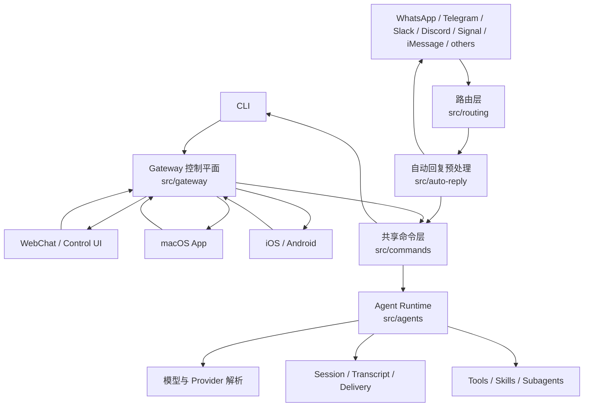
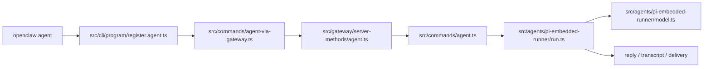
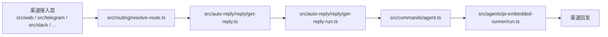

# OpenClaw 项目源码分析

本文是一份合并版源码导览，目标同时覆盖三类读者：

- 新手：想先快速知道“这个项目到底怎么跑起来”
- 进阶开发者：想找到核心目录、关键文件和调用链
- 架构视角读者：想理解它为什么会这样分层，以及这种分层解决了什么问题

如果只想先看一句话结论，可以直接记住下面这句：

> OpenClaw 的核心不是某个 UI，也不是某个聊天渠道，而是一套被 CLI、Gateway、App、消息渠道共同复用的 agent 执行内核。

---

## 1. 新手先看：三分钟建立整体心智模型

### 1.1 这个项目到底是什么

从源码来看，OpenClaw 不是单一产品形态，而是一套“个人 AI 助手平台”的运行时系统。它有很多入口：

- CLI
- WebChat / Control UI
- macOS App
- iOS / Android 节点
- 多种消息渠道，例如 WhatsApp、Telegram、Slack、Discord、Signal、iMessage 等

这些入口最后不会各自调用一套独立模型逻辑，而是尽量汇聚到统一的 Gateway 和共享 agent 运行时。

### 1.2 用最朴素的话理解它

你可以把 OpenClaw 想成四层：

1. 最外层：用户从哪里发起请求
2. 中间层：系统如何把请求变成标准 agent 任务
3. 核心层：agent 如何选择模型、跑工具、维护会话
4. 出口层：结果如何被发回到 CLI、App 或聊天渠道

换成一句更工程化的话就是：

`入口层 -> Gateway / commands -> agent runtime -> model/tool/session -> 结果投递`

### 1.3 为什么这个视角重要

很多人第一次读这类仓库时，会先盯着某个界面或者某个渠道模块看，结果越看越散。  
这个项目更好的阅读方式不是“从前端往下看”，而是先抓住共享执行内核，再回头看不同入口如何接入它。

---

## 2. Mermaid 架构图

### 2.1 整体架构图



### 2.2 核心 agent 执行链图



### 2.3 消息渠道自动回复链图



---

## 3. 仓库结构总览

如果按职责划分，这个仓库可以理解为几块核心区域。

### 3.1 `src/`：最重要的主仓

`src/` 是 OpenClaw 的核心实现区，里面最值得优先建立认知的是下面这些目录。

#### `src/cli`

负责 CLI 启动、命令注册、参数解析。  
它主要解决“用户如何调用系统”，不负责复杂业务本身。

#### `src/commands`

这是共享业务层。  
CLI、Gateway，以及其他内部入口，最终都会尽量落到这里。  
其中 `src/commands/agent.ts` 是整个单次 agent 执行最关键的总调度器之一。

#### `src/gateway`

这是统一控制平面。  
它通过 WebSocket / RPC 对外暴露能力，供 CLI、WebChat、macOS、iOS、Android 和其他客户端使用。

你可以把它理解为：

- 系统总线
- 统一入口
- 状态事件分发中心

#### `src/agents`

这里是核心 agent 运行时。  
包括但不限于：

- 模型选择
- provider 解析
- auth profile
- skills
- workspace
- subagents
- embedded Pi runner
- tool 调用
- fallback 与重试

#### `src/auto-reply`

这是“外部消息转 agent 任务”的关键层。  
它不直接等于模型调用，而是负责在模型执行之前把上下文装好。

它处理的内容包括：

- 消息理解
- directives
- media understanding
- link understanding
- typing
- session 初始化与恢复
- 回复包装

#### `src/routing`

负责把消息来源映射成内部 `agentId` 和 `sessionKey`。  
这是多渠道系统能共享同一套 agent 内核的基础层。

#### `src/web`、`src/discord`、`src/slack`、`src/telegram`、`src/signal`、`src/imessage`

这些目录主要是渠道接入层。  
它们负责：

- 收消息
- 识别上下文
- 发回复

但不应该被理解为“各自有一套完整 agent 实现”。

#### `src/channels`

渠道抽象与渠道共享逻辑。

#### `src/providers`

provider 相关能力所在目录。  
不过真正和模型落地执行最强关联的逻辑，仍然主要集中在：

- `src/agents/model-selection.ts`
- `src/agents/pi-embedded-runner/model.ts`

### 3.2 `apps/`：客户端与节点

- `apps/macos`
- `apps/ios`
- `apps/android`

这些目录代表的是不同终端形态，但它们并不是“分别实现各自的 agent”，而是通过 Gateway 协议接入同一套核心后端。

### 3.3 `extensions/`：扩展生态

`extensions/*` 表明 OpenClaw 有明确的插件化设计，不是完全封闭的单体系统。  
很多扩展渠道、工具和附加能力都可以在这个层面演进。

### 3.4 其他辅助目录

- `docs/`：文档
- `scripts/`：构建、开发、发布脚本
- `skills/`：技能相关资源
- `test/` 与 `*.test.ts`：测试
- `dist/`：构建产物

---

## 4. 先从哪读最不容易迷路

如果你是第一次看这套源码，建议不要随机点文件，而是按下面顺序建立主链路。

1. `src/cli/program/register.agent.ts`
2. `src/commands/agent-via-gateway.ts`
3. `src/gateway/server-methods/agent.ts`
4. `src/commands/agent.ts`
5. `src/agents/pi-embedded-runner/run.ts`
6. `src/agents/pi-embedded-runner/model.ts`
7. `src/routing/resolve-route.ts`
8. `src/auto-reply/reply/get-reply.ts`

这个顺序的好处是：

- 先抓住入口
- 再看共享调度
- 最后看路由和自动回复补充层

---

## 5. 入口层是怎么接到 agent 的

### 5.1 CLI 入口

CLI 相关入口的关键文件是：

- `src/cli/program/command-registry.ts`
- `src/cli/program/register.agent.ts`

`register.agent.ts` 会注册 `openclaw agent` 命令，但它本身只是一个“薄入口”。  
它真正的价值在于把命令行参数接到共享业务层，而不是自己承担复杂执行逻辑。

接下来 CLI 会进入：

- `src/commands/agent-via-gateway.ts`

这个文件体现了一个非常重要的架构原则：

- 优先通过 Gateway 跑 agent
- 当 Gateway 不可用，或显式指定 `--local` 时，再回退到 embedded 本地执行

这意味着 CLI 在架构上更像是“统一控制面客户端”，而不是一个直接耦合模型 API 的命令工具。

### 5.2 Gateway 入口

Gateway 端处理 agent 请求的关键文件是：

- `src/gateway/server-methods/agent.ts`

这个模块负责：

- 校验 agent 请求参数
- 规范化 session、channel、delivery、附件等字段
- 处理 `/new`、`/reset` 之类的会话控制指令
- 根据上下文准备 ingress 参数
- 最终调用共享业务层 `agentCommandFromIngress()`

所以 Gateway 并不是另写了一套 agent 系统，而是在充当统一 RPC 入口和控制平面。

---

## 6. 核心 agent 功能是怎么实现的

### 6.1 真正的总调度器：`src/commands/agent.ts`

如果要选一个最应该读的核心文件，`src/commands/agent.ts` 一定在前列。

它的角色不是“完成一个小步骤”，而是对一次 agent turn 做全流程编排。它会负责：

- 解析或创建 session
- 根据 `sessionKey` 推断 `agentId`
- 解析 workspace 和 agentDir
- 构建 skills 快照
- 处理 thinking、verbose、timeout
- 决定 provider / model / fallback
- 处理 auth profile
- 选择走 ACP 还是 embedded Pi runtime
- 写 transcript 与 session store
- 在需要时把结果投递回外部渠道

因此这个文件更像一个 orchestration 层，而不是一个“模型调用函数”。

### 6.2 真正跑起来的执行引擎：`src/agents/pi-embedded-runner/run.ts`

`src/commands/agent.ts` 决定“怎么编排”，  
`src/agents/pi-embedded-runner/run.ts` 决定“怎么执行”。

`runEmbeddedPiAgent()` 里包含很多工程化运行逻辑，主要包括：

- lane / queue 调度
- plugin hooks
- 上下文窗口保护
- auth profile 的选择、打标、冷却和恢复
- 重试与 failover
- 工具结果上下文管理
- usage / token / cost 统计

也就是说，这个函数不是“调一次模型 API”那么简单，而是一个已经具备生产运行防护能力的 agent runtime。

### 6.3 模型与 provider 统一解析：`src/agents/pi-embedded-runner/model.ts`

这个文件解决的是“配置里写的 provider/model，最终如何变成可运行对象”。

它主要负责：

- provider 名称标准化
- 从模型注册表解析模型
- 应用 provider 级别覆盖项
- 处理 forward-compat 模型
- 处理像 OpenRouter 这类透传 provider
- 生成统一的 model 定义对象

这意味着 OpenClaw 对多 provider 的兼容，不是散落在业务代码里的大量分支，而是被尽量收敛到统一模型解析层。

### 6.4 routing 不是附属功能，而是主干：`src/routing/resolve-route.ts`

很多系统里“路由”只是边角逻辑，但在 OpenClaw 里不是。

它需要解决的是：

- 这条消息属于哪个 agent
- 这条消息应该进入哪个 sessionKey
- 多个渠道、多个账号、私聊、群聊、团队场景，如何稳定地落到一致的内部会话语义

它会综合考虑：

- `channel`
- `accountId`
- `peer`
- `parentPeer`
- `guildId`
- `teamId`
- `memberRoleIds`

从架构意义上说，`resolve-route.ts` 是“多入口系统仍然能共享单内核”的关键支点之一。

### 6.5 聊天消息并不是直接送进模型：`src/auto-reply/reply/get-reply.ts`

这个模块的价值在于，它把“真实世界里的消息”预处理成“标准 agent run 请求”。

它会做的事情包括：

- 解析目标 agent 和 session
- 合并 skill filter
- 决定默认 provider / model
- 初始化或恢复 session 状态
- media understanding
- link understanding
- reset 流程处理
- directive 处理
- typing 控制
- 最终把标准化后的请求交给后续 runner

这层的存在说明 OpenClaw 很强调“消息上下文装配”，而不是把所有问题粗暴地下沉给模型。

---

## 7. 两条最重要的调用链

### 7.1 从 CLI 发起一次 agent 运行

1. `src/cli/program/command-registry.ts`
2. `src/cli/program/register.agent.ts`
3. `src/commands/agent-via-gateway.ts`
4. `src/gateway/server-methods/agent.ts`
5. `src/commands/agent.ts`
6. `src/agents/pi-embedded-runner/run.ts`
7. `src/agents/pi-embedded-runner/model.ts`
8. transcript / delivery / reply output

### 7.2 从消息渠道触发一次自动回复

1. 渠道接入层收到消息，例如 `src/web/*` 或其他 channel 模块
2. `src/routing/resolve-route.ts` 决定目标 `agentId` 与 `sessionKey`
3. `src/auto-reply/reply/get-reply.ts` 整理上下文
4. `src/auto-reply/reply/get-reply-run.ts`
5. 共享调度层 `src/commands/agent.ts`
6. `src/agents/pi-embedded-runner/run.ts`
7. 最终由渠道层把结果回发

### 7.3 类 Unix 风格时序图

如果你更习惯从“一个请求在系统里如何流动”来理解代码，可以把一次 CLI 调用近似看成下面这样：

```text
$ openclaw agent --agent ops --message "summarize logs"
        |
        v
[src/cli/program/register.agent.ts]
  registerAgentCommands()
        |
        v
[src/commands/agent-via-gateway.ts]
  agentCliCommand()
    -> 默认走 agentViaGatewayCommand()
    -> Gateway 失败时回退 agentCommand()
        |
        v
[src/gateway/server-methods/agent.ts]
  agentHandlers.agent()
    -> 校验参数
    -> 规范化 session / delivery / idempotency
    -> dispatchAgentRunFromGateway()
        |
        v
[src/commands/agent.ts]
  agentCommandFromIngress()
    -> agentCommand()
    -> 解析 session / agentId / workspace / skills / timeout
    -> 决定 ACP 还是 embedded runner
        |
        v
[src/agents/pi-embedded-runner/run.ts]
  runEmbeddedPiAgent()
    -> lane / queue
    -> hooks
    -> resolveModel()
    -> auth profile / retry / failover
    -> tool execution / usage stats
        |
        v
[src/agents/pi-embedded-runner/model.ts]
  resolveModel()
    -> resolveModelWithRegistry()
    -> 产出统一 provider/model 定义
        |
        v
[session / transcript / delivery]
  写入会话状态
  生成回复 payload
  必要时投递回渠道
        |
        v
CLI / WebChat / App / 消息渠道收到最终结果
```

如果换成聊天渠道入口，前半段会变成这样：

```text
外部消息进入渠道适配层
        |
        v
[src/routing/resolve-route.ts]
  resolveAgentRoute()
    -> 算出 agentId + sessionKey
        |
        v
[src/auto-reply/reply/get-reply.ts]
  预处理消息上下文
    -> media / link understanding
    -> directive / typing / session state
        |
        v
[src/auto-reply/reply/get-reply-run.ts]
  runPreparedReply()
        |
        v
[src/commands/agent.ts]
  agentCommand() / embedded runtime
```

---

## 8. 架构师视角：为什么它要这样分层

### 8.1 入口和核心解耦

OpenClaw 明显在避免“每个入口都自己接模型”的架构陷阱。

如果 CLI、Web、macOS、iOS、Android、各消息渠道都自己去管理模型、上下文、会话、工具调用，那么整个系统很快就会出现：

- 重复实现
- 行为不一致
- 调试困难
- 能力分叉

现在的做法是：

- 入口层只负责接入
- Gateway 负责统一控制面
- commands 负责共享业务编排
- agents 负责核心智能体运行

这是一种比较成熟的“多端共享智能内核”设计。

### 8.2 routing 和 session 是第一公民

OpenClaw 不是“收到消息就单次问模型”的简单机器人。  
从源码能看出它非常重视这些长期存在的系统概念：

- `agentId`
- `sessionKey`
- `transcript`
- `delivery`
- `sendPolicy`
- `history`
- `group / peer / account` 归属关系

这说明它的目标不是一次性问答，而是持续运行、跨渠道、一致可追踪的 agent 系统。

### 8.3 auto-reply 是消息域和 agent 域之间的防腐层

`src/auto-reply` 的存在，本质上是在做一件很重要的事：

把外部消息世界的不规则性，转换成 agent 运行时可接受的规范化任务。

这层如果不存在，消息渠道的复杂度就会直接污染到 agent runtime。  
有了这层以后，agent runtime 可以更多专注于：

- 模型执行
- 工具调用
- 会话推进
- fallback 与恢复

### 8.4 provider 抽象让上层业务保持稳定

如果 provider 差异散落在上层业务里，系统会越来越难维护。  
OpenClaw 通过模型解析与 provider 规范化，把差异尽量压在底层，带来的好处包括：

- 上层 orchestration 更稳定
- 新 provider 更容易接入
- fallback 更容易统一实现
- auth 管理更集中

### 8.5 运行时具备工程化防护

从源码可以看出它不是一个 demo 型 agent：

- 有 context window guard
- 有 auth profile 失败冷却
- 有 lane / queue 控制
- 有 retry / failover
- 有 transcript 和 session store
- 有 usage / token / cost 统计

这些都说明它是按“长期运行的 agent 平台”而不是“单次模型包装器”来设计的。

---

## 9. 关键文件阅读价值说明

### `src/cli/program/register.agent.ts`

适合看“命令是怎么接入系统的”。  
它帮助你建立最外层入口的直觉。

### `src/commands/agent-via-gateway.ts`

适合看“为什么 Gateway 是默认执行路径”。  
这里能看到 CLI 与统一控制平面的关系。

### `src/gateway/server-methods/agent.ts`

适合看“外部 agent 请求在 Gateway 里如何落地”。  
它是 RPC 入口的核心实现。

### `src/commands/agent.ts`

适合看“一个 agent turn 的完整调度”。  
这是系统最像总指挥的文件。

### `src/agents/pi-embedded-runner/run.ts`

适合看“agent runtime 真正做了哪些保护和执行逻辑”。  
这是执行内核的核心。

### `src/agents/pi-embedded-runner/model.ts`

适合看“多 provider 模型如何统一成可运行对象”。  
这是模型抽象的重要落点。

### `src/routing/resolve-route.ts`

适合看“多渠道多身份环境下，会话是怎么稳定绑定的”。  
这是系统能跨渠道共享内核的关键。

### `src/auto-reply/reply/get-reply.ts`

适合看“聊天消息在进入 agent 之前被做了哪些准备”。  
这是连接消息世界与 agent 世界的重要桥梁。

### 9.1 关键函数索引速查

如果你已经知道要看哪个文件，下面这份索引可以帮助你直接跳到更关键的符号。

#### `src/cli/program/register.agent.ts`

- `registerAgentCommands()`
  - 注册 `openclaw agent` 与 `openclaw agents` 命令，是 CLI 接入 agent 功能的最外层入口。

#### `src/commands/agent-via-gateway.ts`

- `agentCliCommand()`
  - CLI 总入口。决定是优先走 Gateway，还是在需要时回退到本地 embedded 执行。
- `agentViaGatewayCommand()`
  - 构造 RPC 请求，调用 Gateway 的 `agent` 方法，并处理 CLI 输出。

#### `src/gateway/server-methods/agent.ts`

- `agentHandlers.agent`
  - Gateway 侧 agent RPC 入口，负责参数校验、session 规范化、幂等处理和请求分发。
- `dispatchAgentRunFromGateway()`
  - 真正把 Gateway 请求转发到共享业务层，并写入去重缓存与最终响应。

#### `src/commands/agent.ts`

- `agentCommand()`
  - 单次 agent turn 的核心编排入口，适合看完整执行过程。
- `agentCommandFromIngress()`
  - 从 Gateway 或其他 ingress 调进来的包装入口，用于把外部输入统一转换成 `agentCommand()` 所需格式。

#### `src/agents/pi-embedded-runner/run.ts`

- `runEmbeddedPiAgent()`
  - embedded agent 真正执行入口，负责 lane、hooks、context guard、auth profile、重试、failover、usage 等核心运行逻辑。

#### `src/agents/pi-embedded-runner/model.ts`

- `resolveModel()`
  - 对外最重要的模型解析入口，把 provider/model 请求解析成统一可执行定义。
- `resolveModelWithRegistry()`
  - 从模型注册表和配置覆盖项中解析模型，是 `resolveModel()` 的关键下层实现。
- `buildInlineProviderModels()`
  - 把配置中的内联 provider/models 展开成统一结构，便于后续解析。

#### `src/routing/resolve-route.ts`

- `resolveAgentRoute()`
  - 路由核心函数，根据渠道、账号、peer、guild、team 等上下文算出目标 `agentId` 和 `sessionKey`。
- `buildAgentSessionKey()`
  - 把 agent、channel、account、peer 等信息编码成内部 session key。
- `resolveInboundLastRouteSessionKey()`
  - 决定最后一跳消息记录应落在主会话还是当前子会话。

#### `src/auto-reply/reply/get-reply.ts`

- `getReplyFromConfig()`
  - 聊天消息预处理的核心入口，负责组装上下文、默认模型、session 状态和指令结果。

#### `src/auto-reply/reply/get-reply-run.ts`

- `runPreparedReply()`
  - 承接预处理后的消息，继续组织 model state、队列、typing、reset 和真正的 agent 执行。

---

## 10. 如果你要继续深挖，建议怎么读

### 10.1 新手路线

适合想先跑通整体理解的人：

1. 看 `src/cli/program/register.agent.ts`
2. 看 `src/commands/agent-via-gateway.ts`
3. 看 `src/commands/agent.ts`
4. 看 `src/agents/pi-embedded-runner/run.ts`

目标是先理解“命令怎么变成一次 agent run”。

### 10.2 消息渠道路线

适合想理解自动回复和多渠道接入的人：

1. 看某个具体渠道目录，例如 `src/web` 或 `src/telegram`
2. 看 `src/routing/resolve-route.ts`
3. 看 `src/auto-reply/reply/get-reply.ts`
4. 再回到 `src/commands/agent.ts`

目标是理解“真实消息如何进入统一内核”。

### 10.3 架构路线

适合想评估设计取舍的人：

1. 看 `src/gateway`
2. 看 `src/commands`
3. 看 `src/agents`
4. 看 `src/routing`
5. 看 `src/auto-reply`

目标是理解“为什么这是多入口单内核，而不是多个独立机器人”。

---

## 11. 这套架构最有价值的地方

从源码角度看，OpenClaw 最强的地方不只是功能多，而是下面这些设计点比较扎实。

### 11.1 把入口和内核分开

CLI、App、Web、消息渠道都只是入口；  
核心智能体能力尽量收敛在共享层，避免多套实现分叉。

### 11.2 把消息系统和 agent 系统解耦

渠道层负责接入，routing 负责映射，auto-reply 负责上下文整理，agent runtime 负责推理和工具执行。  
每层都有比较清晰的职责边界。

### 11.3 把 provider 差异尽量收敛到底层

这样不同模型后端不会撕裂上层业务流程。

### 11.4 重视长期状态，而不只是单轮问答

从 session、history、transcript、delivery 等机制能看出，这个系统是按持续运行的 agent 来设计的。

### 11.5 runtime 有明确的工程化护栏

context guard、auth profile、retry、failover、lane 控制、usage 统计，这些都说明它是可以承载复杂运行场景的，而不只是演示项目。

---

## 12. 一句话总结

OpenClaw 的源码核心可以概括为：

> 用 Gateway 和 commands 统一所有入口，用 routing 和 auto-reply 把真实消息整理成标准 agent run，再由 `src/agents/*` 中的共享运行时完成模型选择、工具调用、会话管理和结果返回。

如果你只记住四个最关键目录，那就是：

- `src/commands`
- `src/agents`
- `src/routing`
- `src/auto-reply`

理解这四层之间的协作关系，整个项目的主干基本就通了。
